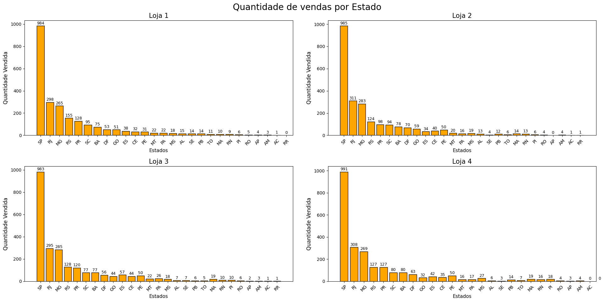
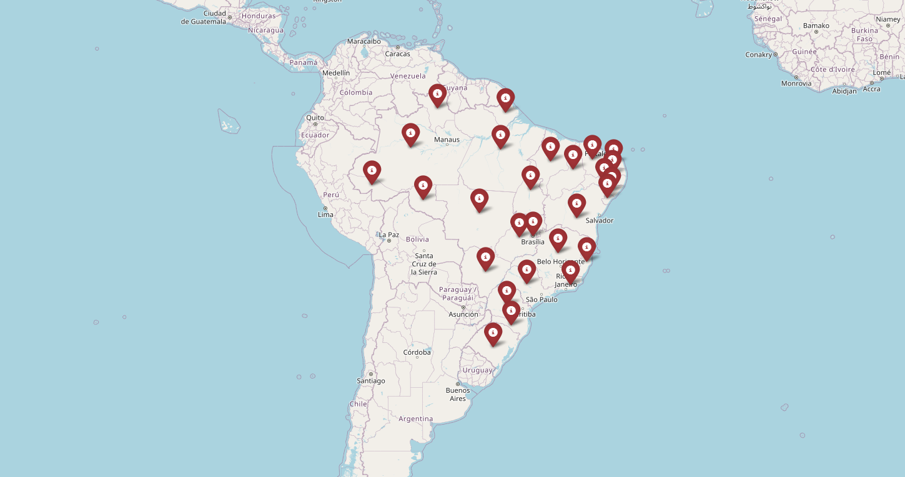

<h1> :bar_chart: Projeto Store - Data Science</h1>

## :round_pushpin: Introdução 
Este projeto foi proposto como parte do curso de Modelagem de Dados com Python da Trilha de Data Science do Programa Oracle ONE. 

Durante o desafio foi realizada uma Análise exploratória das vendas da loja Store no Brasil, separadas por filiais, cidade e categoria de produtos.

Este projeto utiliza dados simulados de vendas para criar visualizações que ajudam a entender o desempenho de cada loja a fim de facilitar aos proprietários a escolha de qual loja vender.

O Relatório final com a conclusão/sugestão pode ser lido no arquivo [Relatório_Final.md](Relatorio_Final.md)

## :books: Linguagem e Bibliotecas uilizadas
* Python
* Pandas
* Matplotlib
* Folium
  
## :notebook_with_decorative_cover: Como utiliza-lo
🚀 Como Utilizar o Projeto

## 1. Clone o repositório ou baixe os arquivos .ipynb
```bash
git clone https://github.com/lazybytebr/challenge-ds-one-store.git
````

## 2. Abra o arquivo no Google Colab ou em seu editor com as bibliotecas necessárias instaladas.
```bash
google colab
````

## :dart: Objetivos da análise

* Visualizar o Faturamento de cada loja;
* As Categorias mais vendidas;
* Média das Avaliações dos clientes dividido por loja;
* Produtos mais vendidos;
* Frete médio.
* Quantidades de vendas por Estado.
* Estados com vendas.

## :bulb: Visualização dos dados
### 1. Faturamento Total por loja


### 2. Categorias mais vendidas


### 3. Média de avaliações dos clientes


### 4. Produtos Mais vendidos


### 5. Produto menos vendidos


### 5. Custo do Frete Médio por loja


### 6. Quantidade de Vendas Realizadas por estado


### 7. Mapa Territorial mostrando a presença das lojas do seu João



## ⚠️ Projeto Desenvolvido por:

### Linkedin: https://www.linkedin.com/in/maycon-war-dev-3d/
