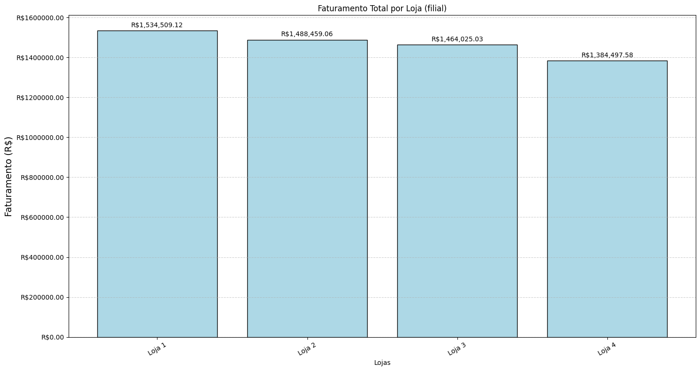
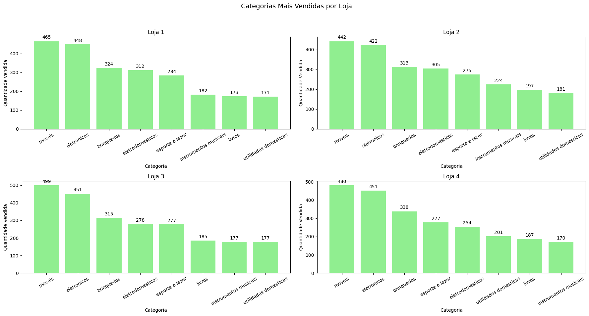
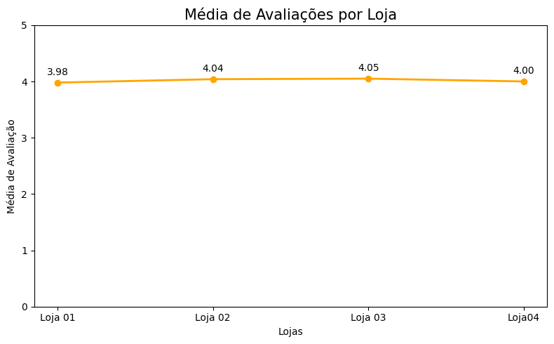
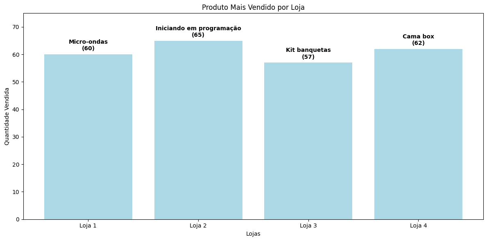
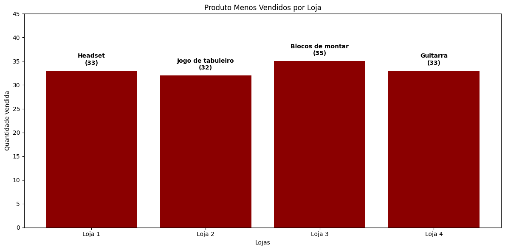
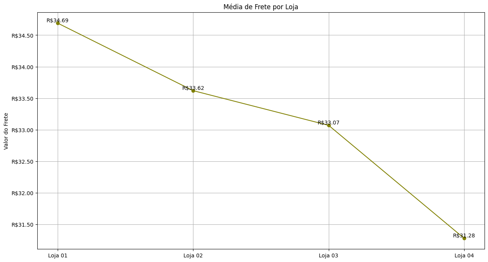

# 📊 Relatório Final de Análise das Lojas

# **Objetivo da Análise**

O objetivo deste relatório é auxiliar o proprietário na tomada de decisão sobre qual das quatro lojas deve ser vendida. 

Para isso, foi realizada uma análise detalhada com base nos seguintes critérios:

*   Faturamento total das lojas
*   Desempenho por categoria de produtos
*   Desempenho por categoria de produtos
*   Produtos mais e menos vendidos
*   Gasto e média com frete

________________________________________
# **1.** **Faturamento Total**

A análise do faturamento total revelou os seguintes resultados:

*   **Loja 1:**  R$ 1.534.509,12

*   **Loja 2:**  R$ 1.488.459,06

*   **Loja 3:**  R$ 1.464.025,03

*   **Loja 4**:  R$ 1.384.497,58

🔼 Maior Faturamento: Loja 1

🔽 Menor Faturamento: Loja 4

**Conclusão:** A **Loja 1** é a mais lucrativa, enquanto a **Loja 4** tem o menor faturamento.

________________________________________
# **2.** **Categorias de Produtos Mais e Menos Vendidas**

A categoria mais vendida em todas as lojas foi **"móveis"**, seguida por **"eletrônicos"** e **"brinquedos"**. As menos vendidas variam, com **"livros”**, **“instrumentos musicais"** e **"utilidades domésticas"** aparecendo com menor frequência em algumas lojas.

**Conclusão:** As categorias de alto valor estão bem distribuídas entre as lojas, com destaque consistente para móveis.

________________________________________
# **3. Média de Avaliação dos Clientes**

As médias de avaliação por loja foram:

*   **Loja 1:** 3,98

*   **Loja 2:** 4,04

*   **Loja 3:** 4,05

*   **Loja 4:** 4,00

🏆 **Melhor Avaliação:** Loja 3
📉 **Pior Avaliação:** Loja 1

**Conclusão:** A **Loja 3** apresenta a melhor satisfação do cliente, enquanto a **Loja 1** tem o menor desempenho nesse aspecto.

________________________________________
# **4. Produtos Mais e Menos Vendidos**

**• Mais vendidos:** Loja 2 (com 65 unidades de **“Iniciando em programação”**) e Loja 4 (com 62 unidades de **“Cama box”**).
**• Menos vendidos:** Loja 2 e Loja 4 possuem produtos com vendas muito baixas, abaixo de 35 unidades. O produto com menos saída foi **“jogo de tabuleiro”** da Loja 2 e **“guitarra”** da Loja 4.

**Conclusão:** Há equilíbrio nos produtos de maior saída, mas lojas como a 4 e a 2 têm itens com baixa rotatividade.

________________________________________
# **5. Frete Médio por Loja**

**Loja  - Total Frete  Frete Médio**

Loja 1  81.837,97 34,69

Loja 2  79.314,16 33,62

Loja 3  78.022,66 33,07

Loja 4  73.755,88 31,28

🔼 **Maior custo médio de frete:** Loja 1
🔽 **Menor custo médio de frete:** Loja 4

**Conclusão:** A **Loja 4** tem o menor custo de frete, o que é positivo, mas não compensa seus outros pontos fracos.

________________________________________
# ✅ **Conclusão e Recomendação Final**

Com base nos dados analisados pode ser observado que a :

*   **Loja 1** tem o maior faturamento, mas apresenta frete mais caro e avaliações medianas.

*   **Loja 2** apresenta desempenho intermediário em todos os quesitos.

*   **Loja 3** se destaca pela melhor avaliação dos clientes e desempenho equilibrado em vendas e frete.

*   **Loja 4** tem o menor faturamento  e desempenho mais fraco em categorias e produtos.

# 🛑 **Recomendação:**

**É sugerido ao proprietário a venda da Loja 4.**

Apesar de ter o menor custo com frete, a Loja 4 apresenta **baixa rentabilidade, avaliação dos clientes baixa e pouco destaque nos produtos mais vendidos.** 
